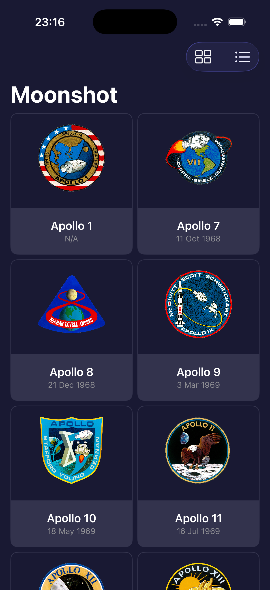
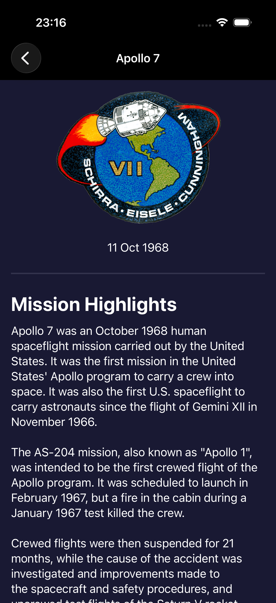
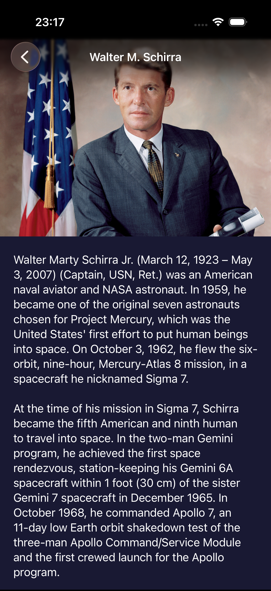

# Moonshot 🚀

**Moonshot** — это интерактивное образовательное приложение для iOS, посвященное истории космической программы NASA «Аполлон». Проект позволяет детально изучить каждую миссию, узнать о составе экипажей и прочитать биографии астронавтов.

## ✨ Особенности проекта

- **Двойной интерфейс**: Возможность переключения между отображением в виде сетки (Grid) и списка (List) через панель инструментов.
- **Глубокая навигация**: Переход от списка миссий к деталям полета, а оттуда — к персональным страницам каждого астронавта.
- **Умная обработка данных**: Использование универсального (Generic) расширения для `Bundle`, которое автоматически декодирует JSON и форматирует даты.
- **Accessibility (Доступность)**: Приложение полностью оптимизировано для VoiceOver:
    - Добавлены понятные метки (`accessibilityLabel`) для изображений.
    - Сгруппированы элементы экипажа для удобного чтения.
    - Декоративные элементы скрыты от экранного диктора.
- **Дизайн**: Стилизованный «космический» интерфейс с поддержкой темной темы и кастомными цветами.

## 🛠 Технологии и подходы

- **Swift 5.9+ / SwiftUI**
- **NavigationStack**: Современная навигация с использованием `navigationDestination(for:)`.
- **JSON & Codable**: Обработка сложных вложенных структур данных.
- **Adaptive Layout**: Использование `LazyVGrid` для адаптации интерфейса под разные размеры экранов.
- **Extensions**: Расширение базовых типов Swift для чистоты кода (например, кастомные стили `ShapeStyle`).

## 📁 Структура проекта

*   `ContentView.swift` — точка входа в интерфейс, логика переключения Grid/List.
*   `MissionView.swift` — детальный экран миссии с историей и списком экипажа.
*   `AstronautView.swift` — страница с биографией и фото астронавта.
*   `CrewView.swift` — отдельный компонент для горизонтального скролла команды.
*   `Models/` — структуры данных `Mission` и `Astronaut`.
*   `Extensions/` — вспомогательный код для декодирования JSON и настройки темы оформления.

## 🚀 Установка и запуск

1. Клонируйте репозиторий:
    ```bash
    git clone https://github.com/Serge-17/Moonshot.git
    ```
2. Откройте проект в Xcode:
    ```bash
    open Moonshot.xcodeproj
    ```
3. Выберите симулятор (например, iPhone 15 или 16) и нажмите **Run** (`Cmd + R`).

## 📸 Скриншоты

| Главный экран | Детали миссии | Страница астронавта |
| :---: | :---: | :---: |
|  |  |  |

*(Примечание: Замените заглушки на реальные скриншоты вашего приложения)*

## 👨‍💻 Автор

**Serge Eliseev**
- GitHub: [@Serge-17](https://github.com/Serge-17)

---
*Проект выполнен в рамках изучения разработки на SwiftUI.*
